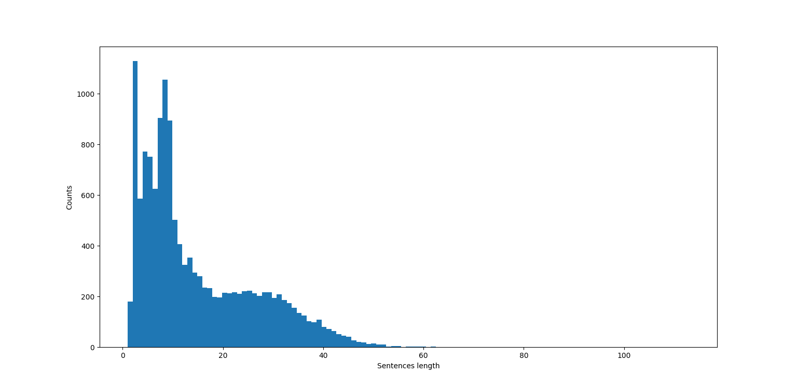
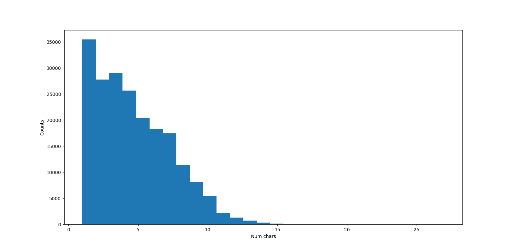

# NER_biLSTM-CNN

Implementation of the named entity recognition (NER) neural network based on the article https://arxiv.org/abs/1511.08308, featuring in particular 
a CNN embedding layer for character-level embedding.

## Contents

- **data** contains the .txt file from the CoNLL-2003 train dataset, every dataset formatted as 

~~~
EU NNP B-NP B-ORG
rejects VBZ B-VP O
German JJ B-NP B-MISC
call NN I-NP O
to TO B-VP O
boycott VB I-VP O
British JJ B-NP B-MISC
lamb NN I-NP O
. . O O
~~~

i.e. each word in a line and sentences separated by a new line (\n), will be ok with the preprocessing functions

- **preprocessing.py** contains preprocessing utility functions used from the load of the dataset and embedding .txt file to the output of a suitable dataset
- **architecture.py** contains the custom classes and a function returning the whole model
- **train.py** is a script for the training

## Padding

Concerning the padding, the max length for a sentence has been fixed to 50 words and the max character length has been fixed to 15. 
Both of thees after plotting the distribution of sentences and words length:

  

it is clear that most sentences have at most 50 words and most words have at most 15 characters.

## WordEmbedding

The 50 dimensional GloVe wordembedding has been used as pretrained embedding, in order to build the model one has to load the .txt file, available at https://nlp.stanford.edu/projects/glove/ or on Kaggle

## Results

Using the ```seqeval``` package (https://github.com/chakki-works/seqeval) the following results have been obtained on the dev set:

```
              precision    recall  f1-score   support

         LOC       0.87      0.96      0.91      1829
        MISC       0.82      0.69      0.75       919
         ORG       0.85      0.80      0.83      1340
         PER       0.90      0.97      0.93      1794

   micro avg       0.87      0.88      0.88      5882
   macro avg       0.86      0.85      0.85      5882
weighted avg       0.87      0.88      0.87      5882

```

probabliy improovable optimizing the hyperparameters but coherent with the article
